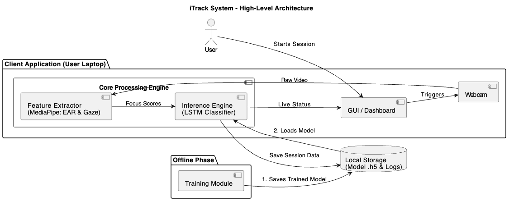

# iTrack: Real-Time Attention Monitoring System 🧠👁️

**iTrack** is a non-intrusive, computer vision-based application designed to monitor and quantify user attention in real-time. Built for educational and corporate environments, it uses a standard webcam to analyze facial cues and classify engagement levels using deep learning.




## 🚀 Key Features

* **Real-Time Monitoring:** Processes live video feed to detect attention states instantly.
* **Multi-Factor Analysis:** Combines **Eye Aspect Ratio (EAR)** for blink/drowsiness detection and a calibrated **Gaze Direction Ratio** to track visual focus.
* **Intelligent Classification:** Uses a trained **Long Short-Term Memory (LSTM)** neural network to classify 15-second activity sequences as 'Focused' or 'Distracted'.
* **Robust to Noise:** Implements a "grace period" algorithm to ignore natural behaviors like blinking and brief glances, preventing false negatives.
* **Privacy-First:** All video processing is done locally on the user's device. No images or video streams are stored or transmitted.
* **Session Analytics:** Generates detailed time-series data and visual graphs for every monitoring session.

## 🛠️ Tech Stack

* **Language:** Python 3.10
* **Computer Vision:** OpenCV, MediaPipe (Google)
* **Deep Learning:** TensorFlow / Keras (LSTM Model)
* **GUI:** Tkinter
* **Data Handling:** NumPy, Pandas

## 📂 Project Structure

```bash
iTrack/
├── main.py                   # The main application (GUI + Real-time Inference)
├── train_lstm.py             # Script to train the LSTM model
├── attention_lstm_model.h5   # The pre-trained LSTM model file
├── simple_facerec.py         # Helper for face recognition
├── util.py                   # Utility functions for the GUI
├── sessions_data/            # Stores raw time-series data from sessions
│   ├── focused/              # Labeled training data (focused)
│   └── distracted/           # Labeled training data (distracted)
└── photos/                   # Database for registered user face embeddings
```

## ⚙️ Installation
Clone the repository:
```bash
git clone [https://github.com/yourusername/iTrack.git](https://github.com/yourusername/iTrack.git)
cd iTrack
Create and Activate a Conda Environment (Recommended):
```
```bash
conda create --name face-project python=3.10
conda activate face-project
Install Dependencies:
```
```bash
pip install opencv-python mediapipe tensorflow scikit-learn matplotlib pillow face-recognition
(Note: dlib is required for face-recognition. If on macOS Apple Silicon, install via conda install -c conda-forge dlib).
```
## 🏃‍♂️ Usage
1. Running the Application
To start the live monitoring dashboard:
```bash
python main.py
Register: Click "Register New User" to capture your face and create a profile.

Login: Click "Login" to authenticate with facial recognition.

Monitor: The system will automatically begin a 15-second attention monitoring session.
```
2. Training the Model (Optional)
* If you want to retrain the LSTM on your own data:

  * Run main.py multiple times to collect session data.

  * Move the resulting .txt files from sessions_data into the focused/ or distracted/ folders based on your behavior.

  * Run the training script:
```bash
python train_lstm.py
This will generate a new attention_lstm_model.h5 file.
```
## 🧠 How It Works
**Feature Extraction:** The system detects 478 facial landmarks using MediaPipe. It calculates the Eye Aspect Ratio (EAR) to determine if eyes are open and computes a Gaze Ratio by comparing the iris position relative to eye corners.

**Time-Series Generation:** It aggregates these metrics into a "focus score" (0.0 to 1.0) for every second of the session.

**Temporal Classification:** A sequence of 15 focus scores is fed into the LSTM model. The model analyzes the temporal pattern to distinguish between sustained focus and distraction patterns.

## 📊 Results
The model achieves **100%** classification accuracy on the test dataset, successfully distinguishing between focused work patterns and distracted behaviors.


## 🛡️ Ethical Considerations
**iTrack is designed as a tool for personal productivity and wellness. It is not intended for surveillance. All biometric data is processed locally, and the system creates anonymized focus scores rather than recording video.**
